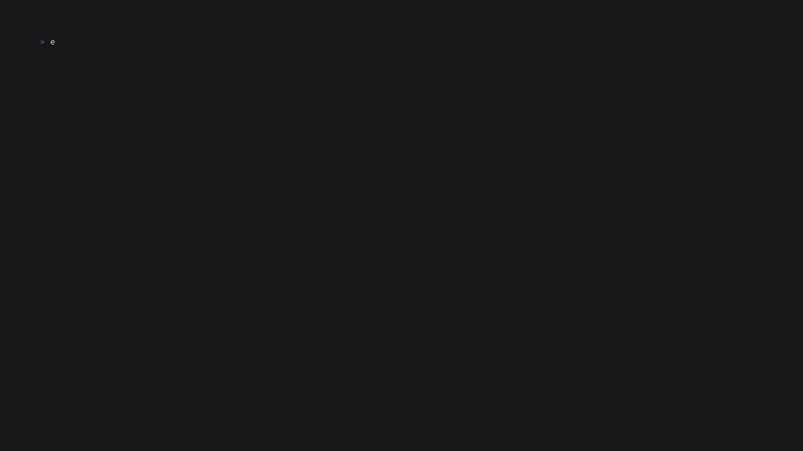

# losrs

*losrs* lets you create Spaced Repetition System (SRS) cards in markdown format
and review them from your terminal.



## Installation

losrs works on Linux, macOS, and (maybe) Windows
and can be installed in different ways:

The recommended way to install losrs is to download
the latest pre-built version for your system[^your-system] from the
[releases page](https://github.com/blin/losrs/releases).

Alternatively, build from source by downloading
[rust](https://www.rust-lang.org/) and running:

```bash
cargo build --release; cp target/release/losrs $YOUR_BIN_DIR
```

[^your-system]: if you would like a new system to be added to releases,
  please file an issue.

## Getting started

Create a "project" directory and
a "pages" directory within it to store the card files
(see [History](#history)):

```sh
mkdir -p my-cards/pages ; cd my-cards; git init .
```

Create a markdown file inside the pages directory
with a top level unordered list, and at least one list item
that ends with `#card`, for example:

```markdown
- What is the format for a losrs card prompt? #card
  - Unordered list item with `#card` in the end
- What is the format for a losrs card response? #card
  - Unordered sublist for an unordered list item with `#card` in the end
```

TODO: the response nodes here might actually be detected as prompt nodes...

You can now review the cards
either in a specific page file via
`losrs review pages/my-first-page.md`
or the whole project via
`losrs review .`

Once you are done reviewing, don't forget to check in your changes!

```sh
git add .; git diff --staged; git commit -m 'Reviewed cards'; git push
```

### Cards with images

Create an "assets" directory within your cards "project directory"

```sh
cd my-cards; mkdir assets
```

Copy the image you would like to use to the assets directory

```sh
cp .../symmetric-lens.png assets/
```

Create a card that refers to the image from "project directory"

```markdown
- How does a symmetric lens look (visualize)? #card
  - {height=50%}
```

Ensure
[image rendering prerequisites](#image-rendering-prerequisites)
are satisfied, then use `losrs show` to confirm the image renders as expected.

#### Image rendering prerequisites

To render images in your cards you can use losrs with
`output.format = "(sixel|kitty|i-term)"`,
see `losrs config --help`.

All image based formats require:

* [Pandoc](https://github.com/jgm/pandoc) available on the `$PATH`
* [Typst](https://github.com/typst/typst) available on the `$PATH`

Each image protocol requires your terminal to support it.
To see which terminals support sixel visit
[Are We Sixel Yet?](https://www.arewesixelyet.com/).

For sixel you will need
`img2sixel` (via [libsixel](https://github.com/saitoha/libsixel))
available on the `$PATH`.
There is an outstanding `TODO` to not require `img2sixel`.

Rendering pipeline is basically:

```text
markdown -> typst -> png -> image-protocol
```

And was inspired by [presenterm](https://github.com/mfontanini/presenterm).
The
[reasons presenterm has for converting LaTeX to Typst](https://github.com/mfontanini/presenterm/blob/master/docs/src/features/code/latex.md?plain=1#L30)
do not apply to this project, but I found it easy to work with this pipeline
so I'm keeping it. It would be nice to remove the dependency on Typst
and to support more LaTeX, but I am unlikely to get around to changing this
any time soon.

## Limitations

Things that are known to NOT work:

* Rendering references
* Rendering LaTeX code that pandoc does not recognise.
  See
  [pandoc's source](https://github.com/jgm/HeX/blob/5bab503606e01c453555545493c43c00398ca408/Text/HeX/Math/LaTeX.hs)
  for a list of symbols that are recognized by pandoc.
* If multiple cards with the same prompt are on the same page,
  when reviewing any of the cards
  the metadata will be updated for one of the cards,
  but not necessarily the one that was due for review.
  This is a consequence of not tracking the position of cards
  in the page, and updating code matching on prompt
  (this can probably be fixed now with CSN matching,
  but requires more thought).
* When rendering via an image based format,
  a card must fit in the terminal window by height.
  Specify a relative height like `{height=50%}` to ensure
  images fit.

## History

This project was created as a workaround for
[Logseq SRS Algorithm being faulty](https://github.com/logseq/logseq/issues/8890)
and the fault
[only being fixed in the database version of Logseq](https://github.com/logseq/logseq/pull/11540)
to the exclusion of plain file version of Logseq.

The Logseq markdown card metadata format is still supported via
the `inline` `storage.metadata_mode`,
but that mode is deprecated and slated for removal[^in-graph-root-deprecated],
as using it is a bit rough due to an additional node property field
that does not get hidden by Logseq.

losrs works with a very narrow subset of Logseq features,
at the very least you need to ensure that
Logseq graph root where you plan to use losrs is configured with
`:export/bullet-indentation :two-spaces` .

[^in-graph-root-deprecated]: If you care about keeping this mode,
  please file an issue.

### Logseq directory layout

losrs borrows the "project" directory layout from Logseq,
which is roughly as follows:

<!-- [tag:logseq-dir-layout] -->

```text
graph_root
├── assets
│   ├── image_1666695381725_0.png
│   ├── ...
└── pages
    ├── Sphere.md
    ├── ...
```
